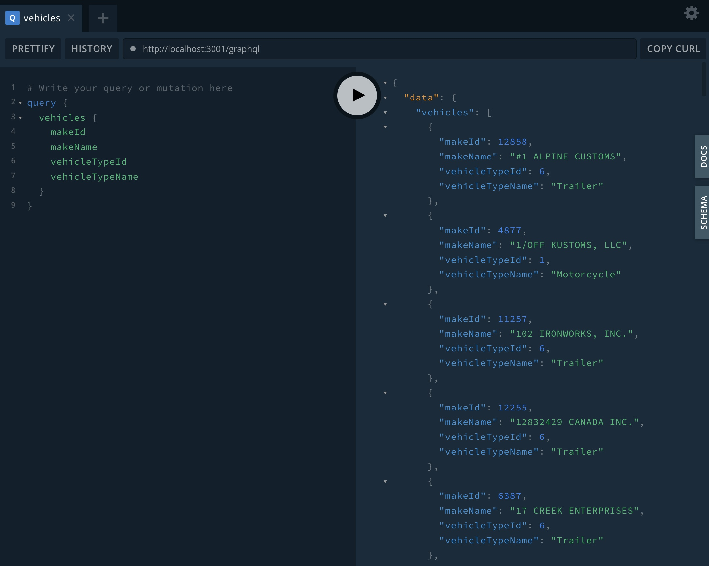

# Vehicle Service



## Description

This project is a service developed with NestJS that parses XML data from two endpoints, transforms it into JSON, and stores it in a MongoDB database. Additionally, it exposes a GraphQL endpoint to access the transformed data.

## Requirements

- Docker
- Docker Compose

## Installation

### Clone the Repository

```bash
git clone https://github.com/laurensortiz/vehicle-service-outcoding.git
cd ehicle-service-outcoding
```

### Set Up Environment Variables
Create a .env file in the root directory and add the following variables:

```bash
MONGO_URI=mongodb://mongodb:27017/nest
```

### Docker Setup

Build and Run the Application
Build and run the containers:

```bash
docker-compose up --build
```
This command will start both the MongoDB service and the NestJS application.

## Access the GraphQL Playground
Open your browser and navigate to:
```bash
http://localhost:3001/graphql
```

## Running Tests
Run the Tests
```bash
docker-compose run tests
```

## Stopping the Application
Stop the Containers
```bash
docker-compose down
```

## Project Structure

```plaintext
src
├── app.module.ts           # Root module of the application
├── main.ts                 # Entry point of the application
├── vehicles
│   ├── dto
│   │   └── create-vehicle.dto.ts  # DTO for creating a vehicle
│   ├── schemas
│   │   └── vehicle.schema.ts      # Mongoose schema for Vehicle
│   ├── vehicles.module.ts         # Vehicles module
│   ├── vehicles.resolver.ts       # GraphQL resolver for vehicles
│   ├── vehicles.service.ts        # Service for fetching and saving vehicles
│   └── __tests__
│       ├── vehicle.schema.spec.ts  # Tests for Vehicle schema
│       └── vehicles.resolver.spec.ts  # Tests for Vehicles resolver
└── jest.config.js            # Jest configuration file
```

## Running the Application
To run the application, use the following command:
```bash
docker-compose up --build
```

To run the tests, use the following command:
```bash
docker-compose run tests
```

To stop the containers, use the following command:
```bash
docker-compose down
```

